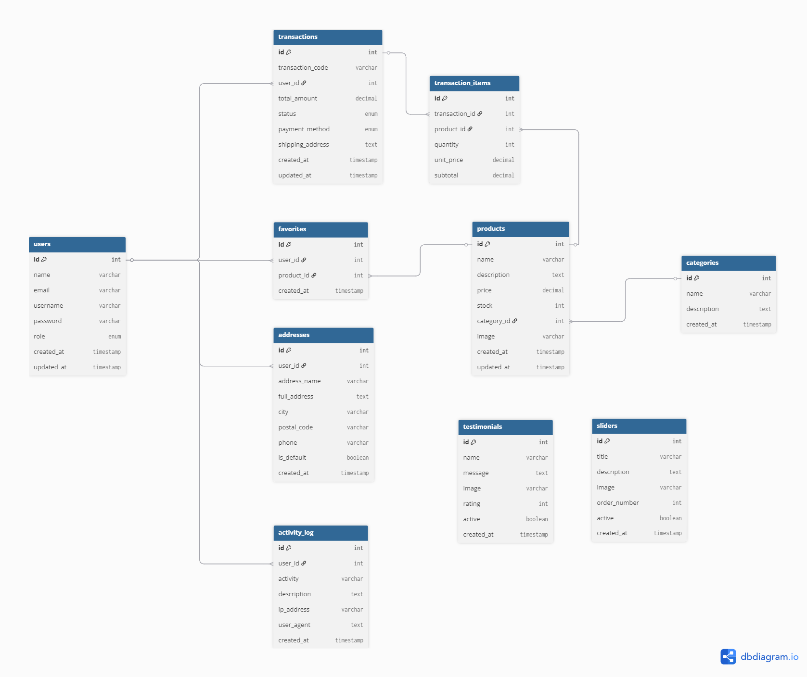

# 🛍️✨ Scarlett Store - Your Beauty Shopping Paradise ✨🛍️

<div align="center">
  
  
  [](https://php.net)
  [](https://mysql.com)
  [](https://getbootstrap.com)
  [](https://sttbontang.ac.id)
  
  **💖 E-commerce Platform Modern & User-Friendly 💖**
  
  *Platform belanja online terpercaya dengan koleksi produk kecantikan terbaik*
</div>

---

## 🌸 **Meet the Developer** 🌸

<div align="center">
  <table>
    <tr>
      <td align="center">👩‍💻</td>
      <td><strong>Nama</strong></td>
      <td>Puspitasari Alfaris</td>
    </tr>
    <tr>
      <td align="center">🎓</td>
      <td><strong>NIM</strong></td>
      <td>202312032</td>
    </tr>
    <tr>
      <td align="center">💌</td>
      <td><strong>Email</strong></td>
      <td>puspitasarialfaris0@gmail.com</td>
    </tr>
    <tr>
      <td align="center">🏫</td>
      <td><strong>Program Studi</strong></td>
      <td>Teknik Informatika</td>
    </tr>
    <tr>
      <td align="center">🏛️</td>
      <td><strong>Institusi</strong></td>
      <td>Sekolah Tinggi Teknologi Bontang</td>
    </tr>
    <tr>
      <td align="center">📚</td>
      <td><strong>Proyek</strong></td>
      <td>Ujian Akhir Semester - Pemrograman Web</td>
    </tr>
  </table>
</div>

---

## 🌐 **Demo & Live Preview**

<div align="center">
  <table>
    <tr>
      <td align="center">
        <a href="#" target="_blank">
          <br/>
          <b>🎥 Video Demo</b><br/>
          <sub>YouTube Presentation</sub>
        </a>
      </td>
      <td align="center">
        <a href="#" target="_blank">
          <br/>
          <b>🌍 Live Demo</b><br/>
          <sub>Hosted Application</sub>
        </a>
      </td>
    </tr>
    <tr>
      <td align="center">
        <a href="#" target="_blank">
          
        </a>
      </td>
      <td align="center">
        <a href="#" target="_blank">
          
        </a>
      </td>
    </tr>
  </table>
</div>

> 📝 **Catatan:** Ganti link `#` di atas dengan URL YouTube dan hosting yang sebenarnya

### 🎬 **Video Demonstration**
- **YouTube Link:** https://youtu.be/VkY6cFPNBKI?feature=shared(#) 
- **Duration:** ~ 5-10 menit
- **Content:** Penjelasan fitur, demo penggunaan, dan code walkthrough

### 🌍 **Live Application**
- **Hosting URL:** puspita.mangaverse.my.id(#)
- **Test Accounts:** Gunakan akun demo yang tersedia
- **Status:** ✅ Online 24/7

---

## 📂 **File Structure**

<div align="center">

```
📁 clone-puspita/
├── 📁 admin/                 # Panel Administrator
│   ├── 📄 index.php         # Dashboard Admin
│   ├── 📄 produk.php        # Manajemen Produk
│   ├── 📄 kategori.php      # Manajemen Kategori
│   ├── 📄 pengguna.php      # Manajemen Pengguna
│   ├── 📄 transaksi.php     # Manajemen Transaksi
│   └── 📁 laporan/          # Sistem Laporan
├── 📁 assets/               # Resources & Media
│   └── 📁 img/             # Images & Graphics
├── 📁 auth/                 # Authentication System
│   ├── 📄 login.php        # Login Interface
│   └── 📄 proses_login.php # Login Processing
├── 📁 backend/              # Backend Configuration
│   └── 📄 koneksi.php      # Database Connection
├── 📁 database/             # Database Files
│   ├── 📄 scarlett_store.sql
│   └── 📄 insert_demo_data.php
├── 📁 docs/                 # Documentation
│   ├── 📄 DATABASE.md       # Database Documentation
│   ├── 📄 DEPLOYMENT.md     # Deployment Guide
│   ├── 📄 INSTALLATION.md   # Installation Guide
│   ├── 📄 USAGE.md          # Usage Manual
│   └── 🖼️ er_diagram.png    # ERD Diagram
├── 📁 user/                 # User Interface
│   ├── 📄 index.php        # Homepage
│   ├── 📄 detail.php       # Product Details
│   └── 📄 riwayat.php      # Transaction History
└── 📄 README.md            # Project Documentation
```

</div>

---

## 🗂️ **Entity Relationship Diagram (ERD)**

<div align="center">
  
  <br/>
  <sub><i>📊 Database relationship structure for Scarlett Store E-commerce System</i></sub>
</div>

---

## 📚 **Dokumentasi Lengkap**

Untuk informasi lebih detail tentang proyek ini, silakan kunjungi dokumentasi lengkap berikut:

<div align="center">
  <table>
    <tr>
      <td align="center">
        <a href="docs/DATABASE.md">
          <br/>
          <b>🗄️ Database</b><br/>
          <sub>Schema & Structure</sub>
        </a>
      </td>
      <td align="center">
        <a href="docs/INSTALLATION.md">
          <br/>
          <b>🔧 Installation</b><br/>
          <sub>Setup Guide</sub>
        </a>
      </td>
      <td align="center">
        <a href="docs/DEPLOYMENT.md">
          <br/>
          <b>🚀 Deployment</b><br/>
          <sub>Production Guide</sub>
        </a>
      </td>
      <td align="center">
        <a href="docs/USAGE.md">
          <br/>
          <b>📖 Usage</b><br/>
          <sub>User Manual</sub>
        </a>
      </td>
    </tr>
  </table>
</div>

### 📋 **Quick Navigation**
- [👩‍💻 Developer Info](#-meet-the-developer-) | [🎬 Demo & Preview](#-demo--live-preview) | [✨ Fitur](#-fitur-utama) | [🏗️ Arsitektur](#️-arsitektur-sistem)
- [📁 Struktur](#-struktur-direktori) | [🚀 Instalasi](#-quick-start-guide) | [🖥️ Usage](#️-cara-penggunaan) | [🔒 Security](#-sistem-keamanan)
- [🎨 Design](#-design-system--ui) | [🐛 Issues](#-troubleshooting) | [📞 Support](#-support--contact) | [📄 License](#-license)

---

## 🚀 Fitur Utama

### Sistem Autentikasi

- Login terpisah untuk Admin dan User
- Session management yang aman
- Password hashing dengan bcrypt
- Log aktivitas pengguna

### Panel Administrator

- Dashboard dengan statistik lengkap
- Manajemen produk (CRUD)
- Manajemen kategori
- Manajemen pengguna
- Manajemen transaksi
- Laporan penjualan
- Log aktivitas sistem

### Panel User

- Homepage dengan slider dan produk
- Katalog produk dengan detail
- Sistem pemesanan
- Riwayat transaksi
- Testimoni pengguna

## 🛠️ Teknologi yang Digunakan

- **Backend**: PHP 7.4+ (Native)
- **Database**: MySQL
- **Frontend**: HTML5, CSS3, JavaScript
- **Framework CSS**: Bootstrap (untuk responsif)
- **Server**: Apache (XAMPP)

## 📋 Persyaratan Sistem

- PHP 7.4 atau lebih tinggi
- MySQL 5.7 atau lebih tinggi
- Apache Web Server
- XAMPP (Recommended)

## 🔧 Cara Instalasi

### 1. Persiapan Environment

```bash
# Download dan install XAMPP
# Pastikan Apache dan MySQL berjalan
```

### 2. Clone/Download Project

```bash
# Extract project ke folder htdocs XAMPP
# Lokasi: C:\xampp\htdocs\scarlett_store
```

### 3. Setup Database

```sql
-- Buka phpMyAdmin (http://localhost/phpmyadmin)
-- Import file database/scarlett_store.sql
-- Atau jalankan script SQL secara manual
```

### 4. Konfigurasi Database

```php
// File: backend/koneksi.php
$host = "localhost";
$user = "root";
$pass = "";
$db   = "scarlett_store";
```

### 5. Insert Data Demo

```bash
# Akses: http://localhost/scarlett_store/database/insert_demo_data.php
# Untuk menambahkan data demo admin dan user
```

## 👤 Akun Demo

### Administrator

- **Username**: admin
- **Password**: admin123
- **Role**: admin

### User Demo

- **Username**: user
- **Password**: user123
- **Role**: user

## 🗂️ Struktur Database

### Tabel Utama

#### users

- `id` (Primary Key)
- `nama` (VARCHAR)
- `email` (VARCHAR, UNIQUE)
- `username` (VARCHAR, UNIQUE)
- `password` (VARCHAR, Hashed)
- `role` (ENUM: admin, user)
- `created_at`, `updated_at`

#### produk

- `id` (Primary Key)
- `nama_produk` (VARCHAR)
- `deskripsi` (TEXT)
- `harga` (DECIMAL)
- `stok` (INT)
- `kategori_id` (Foreign Key)
- `gambar` (VARCHAR)
- `created_at`, `updated_at`

#### kategori

- `id` (Primary Key)
- `nama_kategori` (VARCHAR)
- `deskripsi` (TEXT)
- `created_at`

#### transaksi

- `id` (Primary Key)
- `user_id` (Foreign Key)
- `produk_id` (Foreign Key)
- `jumlah` (INT)
- `harga` (DECIMAL)
- `total_harga` (DECIMAL)
- `tanggal` (TIMESTAMP)
- `status` (ENUM: pending, completed, cancelled)

#### log_aktivitas

- `id` (Primary Key)
- `user_id` (Foreign Key)
- `aktivitas` (VARCHAR)
- `deskripsi` (TEXT)
- `ip_address` (VARCHAR)
- `user_agent` (TEXT)
- `created_at`

## 🔐 Sistem Keamanan

### Autentikasi

- Password di-hash menggunakan `password_hash()` PHP
- Session management yang aman
- Role-based access control
- Protection terhadap SQL injection

### Validasi Input

- `mysqli_real_escape_string()` untuk semua input
- `htmlspecialchars()` untuk output
- Validasi role pada setiap halaman

### Log Aktivitas

- Pencatatan login/logout
- Tracking aktivitas admin
- IP address dan user agent logging

## 📱 Fitur Responsif

- Desain responsive menggunakan CSS Grid dan Flexbox
- Bootstrap untuk komponen UI
- Mobile-friendly interface
- Cross-browser compatibility

## 🎨 Desain UI/UX

### Tema Warna

- Primary: #ff69b4 (Hot Pink)
- Secondary: #d63384 (Pink)
- Background: #fff0f5 (Lavender Blush)
- Accent: #ffcce5 (Light Pink)

### Typography

- Font Family: 'Poppins', sans-serif
- Responsive font sizes
- Consistent spacing

## 📊 Fitur Laporan

### Dashboard Admin

- Total produk, user, transaksi, kategori
- Transaksi terbaru
- Grafik penjualan (future enhancement)

### Laporan Detail

- Laporan transaksi
- Laporan pengguna
- Produk terlaris
- Laporan pendapatan

## 🔄 Alur Kerja Sistem

### User Flow

1. User login dengan memilih role
2. Akses homepage dengan produk dan testimoni
3. Lihat detail produk
4. Lakukan pemesanan
5. Cek riwayat transaksi
6. Logout

### Admin Flow

1. Admin login dengan role admin
2. Akses dashboard dengan statistik
3. Kelola produk, kategori, user
4. Monitor transaksi dan pesanan
5. Generate laporan
6. Cek log aktivitas
7. Logout

## 🚀 Cara Menjalankan

1. **Start XAMPP**

   ```bash
   # Jalankan Apache dan MySQL
   ```

2. **Akses Aplikasi**

   ```
   http://localhost/scarlett_store/auth/login.php
   ```

3. **Login sebagai Admin**

   - Pilih role: Administrator
   - Username: admin
   - Password: admin123

4. **Login sebagai User**
   - Pilih role: User
   - Username: user
   - Password: user123

## 🐛 Troubleshooting

### Database Connection Error

```php
// Pastikan konfigurasi database benar
// Cek apakah MySQL service berjalan
// Verifikasi nama database dan credentials
```

### Session Issues

```php
// Pastikan session_start() dipanggil
// Cek permission folder untuk session
// Clear browser cache dan cookies
```

### File Upload Issues

```php
// Cek permission folder assets/img/
// Verifikasi max file size di php.ini
// Pastikan format file yang diupload sesuai
```

## 📝 Pengembangan Selanjutnya

- [ ] Sistem pembayaran online
- [ ] Notifikasi email
- [ ] Chat customer service
- [ ] Mobile app
- [ ] API REST untuk integrasi
- [ ] Dashboard analytics yang lebih detail
- [ ] Multi-language support
- [ ] SEO optimization

## 👨‍💻 Developer

**Puspitasari Alfaris**

- Email: contact@scarlettstore.com
- Project: Scarlett Store E-Commerce System

## 📄 Lisensi

Project ini dibuat untuk keperluan edukasi dan portfolio. Silakan gunakan dan modifikasi sesuai kebutuhan.

---

**© 2024 Scarlett Store - E-Commerce System**
